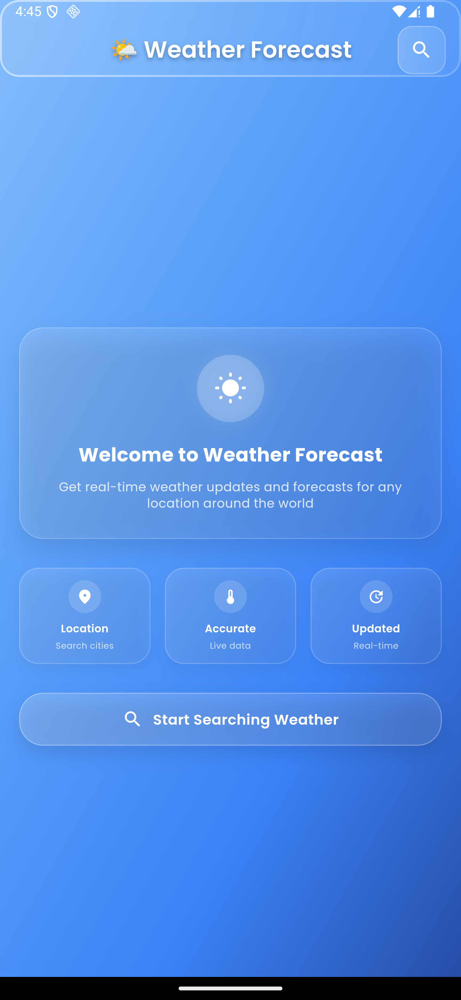
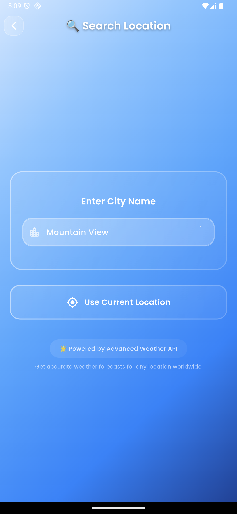
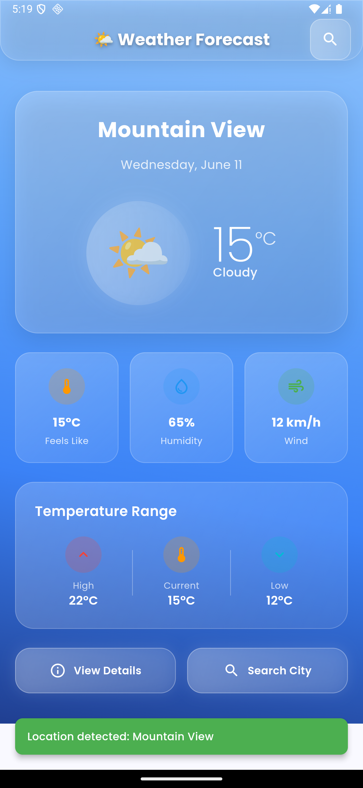
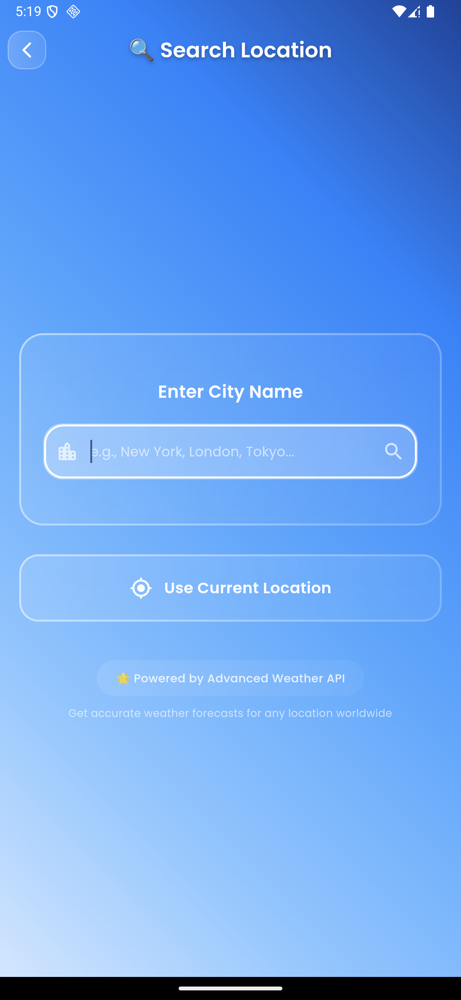

# 🌤️ Weather Forecast App

A modern, beautiful Flutter weather application that provides real-time weather information with a stunning glassmorphic UI design.

## ✨ Features

### 🎨 Modern UI/UX
- **Glassmorphic Design**: Beautiful glass-effect cards with blur and transparency
- **Smooth Animations**: Fluid transitions and micro-interactions using Flutter Animate
- **Dynamic Backgrounds**: Animated gradient backgrounds that change based on weather conditions
- **Professional Typography**: Google Fonts (Poppins) for modern, readable text
- **Responsive Design**: Optimized for different screen sizes

### 🌦️ Weather Features
- **Real-time Weather Data**: Current weather conditions from WeatherAPI
- **Detailed Information**: Temperature, humidity, wind speed, visibility, UV index
- **Temperature Range**: Daily high, current, and low temperatures
- **Weather Conditions**: Clear visual indicators with emojis and descriptions
- **Location-based**: Automatic location detection and manual city search
- **Comprehensive Details**: Sunrise/sunset times, atmospheric pressure, and more

### 🔧 Technical Features
- **State Management**: BLoC pattern for efficient state management
- **API Integration**: WeatherAPI.com integration with error handling
- **Location Services**: GPS-based location detection
- **Search Functionality**: City search with auto-suggestions
- **Offline Handling**: Graceful error handling for network issues
- **Performance Optimized**: Smooth 60fps animations and transitions

## 📱 Screenshots

### Home Screen
<div align="center">
  
  <p><em>Beautiful home screen with current weather display and quick stats</em></p>
</div>

### Weather Details
<div align="center">
  
  <p><em>Comprehensive weather information with detailed metrics</em></p>
</div>

### Search Interface
<div align="center">
  
  <p><em>Intuitive search interface for finding weather in any city</em></p>
</div>

### Error Handling
<div align="center">
  
  <p><em>User-friendly error handling with clear instructions</em></p>
</div>

## 🚀 Getting Started

### Prerequisites
- Flutter SDK (^3.5.3)
- Dart SDK
- Android Studio / VS Code
- WeatherAPI.com API key (free)

### Installation

1. **Clone the repository**
   ```bash
   git clone https://github.com/yourusername/weatherapp.git
   cd weatherapp
   ```

2. **Install dependencies**
   ```bash
   flutter pub get
   ```

3. **Get your API key**
   - Visit [WeatherAPI.com](https://www.weatherapi.com/)
   - Sign up for a free account
   - Copy your API key from the dashboard

4. **Configure API key**
   - Open `lib/Cubits/Get weather Cubit/Getweathercubit.dart`
   - Replace `YOUR_API_KEY_HERE` with your actual API key:
   ```dart
   static const String YOUR_API_KEY = 'your_actual_api_key_here';
   ```

5. **Run the app**
   ```bash
   flutter run
   ```

## 🏗️ Project Structure

```
lib/
├── Cubits/
│   └── Get weather Cubit/
│       ├── Getweathercubit.dart      # Weather state management
│       └── Getweatherstates.dart     # Weather states
├── Models/
│   └── WeatherModel.dart             # Weather data model
├── screens/
│   ├── homePage.dart                 # Main home screen
│   ├── InfoScreenWeather.dart        # Detailed weather view
│   ├── Search.dart                   # City search screen
│   ├── TextNoView.dart              # Welcome/no data screen
│   └── MatreialApp.dart             # App configuration
├── service/
│   └── ApiWeather.dart              # Weather API service
└── main.dart                        # App entry point
```

## 🔧 Dependencies

### Core Dependencies
- **flutter_bloc**: State management with BLoC pattern
- **dio**: HTTP client for API requests
- **google_fonts**: Beautiful typography
- **geolocator**: Location services
- **geocoding**: Address geocoding

### UI/UX Dependencies
- **glassmorphism**: Glass-effect UI components
- **flutter_animate**: Smooth animations and transitions
- **shared_preferences**: Local data storage

## 🌍 API Integration

This app uses [WeatherAPI.com](https://www.weatherapi.com/) for weather data:

- **Free tier**: 1,000,000 calls per month
- **Real-time data**: Current weather conditions
- **Forecast data**: Daily weather forecasts
- **Global coverage**: Weather data for cities worldwide

## 🎨 Design System

### Color Palette
- **Primary**: Dynamic gradients based on weather conditions
- **Glass Effects**: White opacity overlays (10-25%)
- **Text**: White with varying opacity for hierarchy
- **Accents**: Weather-condition specific colors

### Typography
- **Font Family**: Poppins (Google Fonts)
- **Weights**: 200 (Ultra Light) to 700 (Bold)
- **Hierarchy**: Clear size and weight differentiation

### Components
- **Glassmorphic Cards**: Consistent blur and border radius
- **Icons**: Material Design with weather emojis
- **Animations**: Staggered, smooth transitions

## 📱 Supported Platforms

- ✅ Android (API 21+)
- ✅ iOS (iOS 12.0+)
- ✅ Web (Progressive Web App)
- ✅ Windows, macOS, Linux (Desktop)

## 🔐 Permissions

### Android
- `ACCESS_FINE_LOCATION`: For precise location detection
- `ACCESS_COARSE_LOCATION`: For approximate location detection
- `INTERNET`: For API calls

### iOS
- `NSLocationWhenInUseUsageDescription`: Location access while app is in use

## 🚀 Performance

- **Smooth animations**: 60fps with optimized widgets
- **Fast API calls**: Efficient HTTP requests with Dio
- **Memory efficient**: Proper state management with BLoC
- **Battery optimized**: Location services only when needed

## 🤝 Contributing

Contributions are welcome! Please feel free to submit a Pull Request. For major changes, please open an issue first to discuss what you would like to change.

1. Fork the project
2. Create your feature branch (`git checkout -b feature/AmazingFeature`)
3. Commit your changes (`git commit -m 'Add some AmazingFeature'`)
4. Push to the branch (`git push origin feature/AmazingFeature`)
5. Open a Pull Request

## 📄 License

This project is licensed under the MIT License - see the [LICENSE](LICENSE) file for details.

## 🙏 Acknowledgments

- [WeatherAPI.com](https://www.weatherapi.com/) for providing the weather data
- [Flutter](https://flutter.dev/) for the amazing framework
- [Google Fonts](https://fonts.google.com/) for beautiful typography
- [Material Design](https://material.io/) for design guidelines

## 📞 Support

If you have any questions or need help with setup, please open an issue on GitHub or contact the development team.

---

<div align="center">
  <p>Made with ❤️ and Flutter</p>
  <p>⭐ Star this repo if you found it helpful!</p>
</div>
